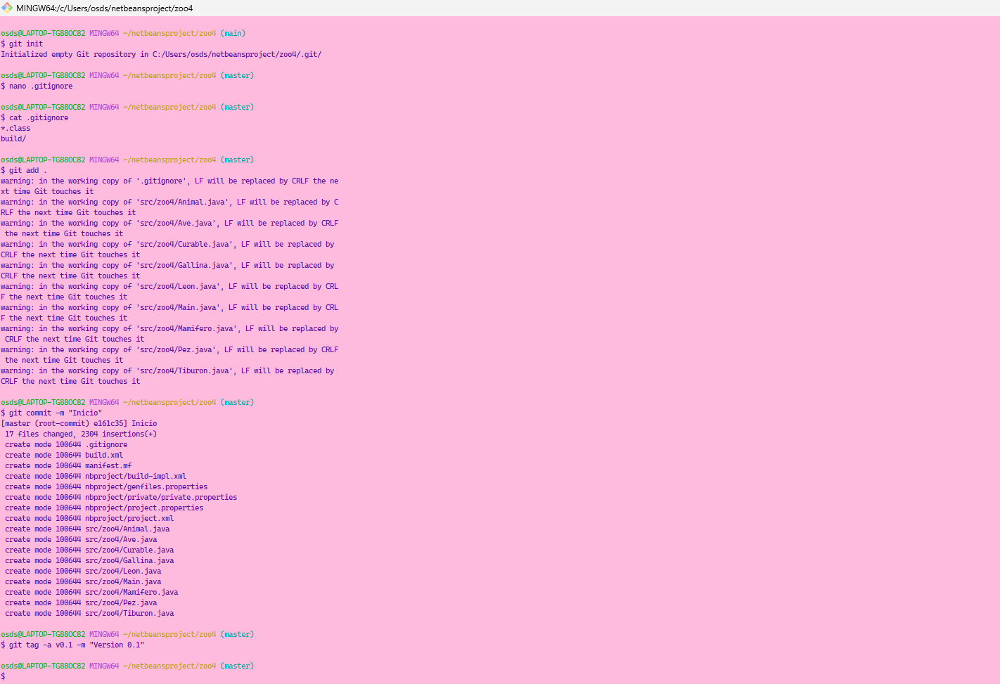
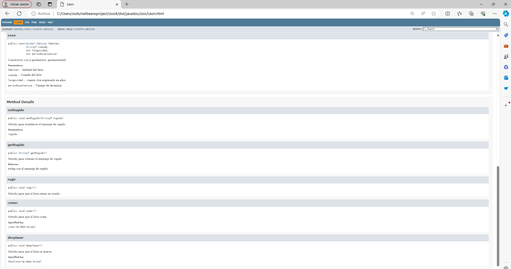
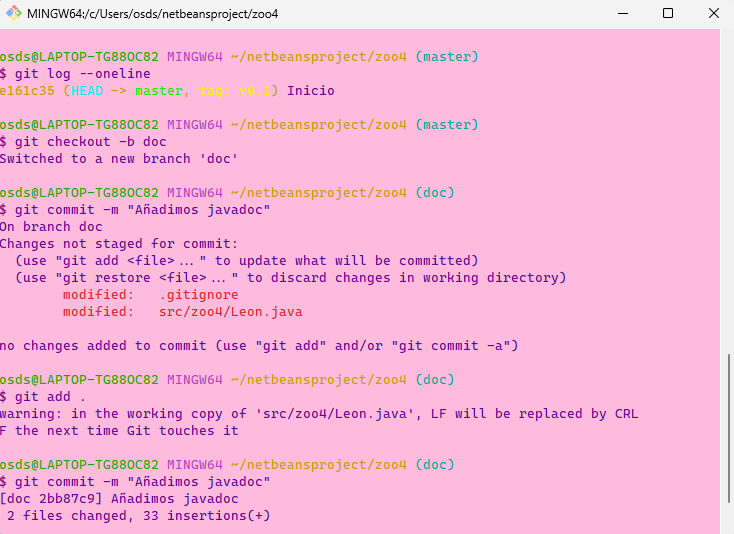
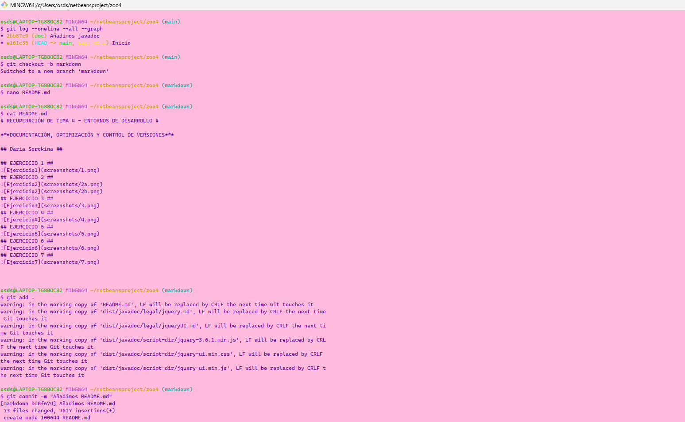
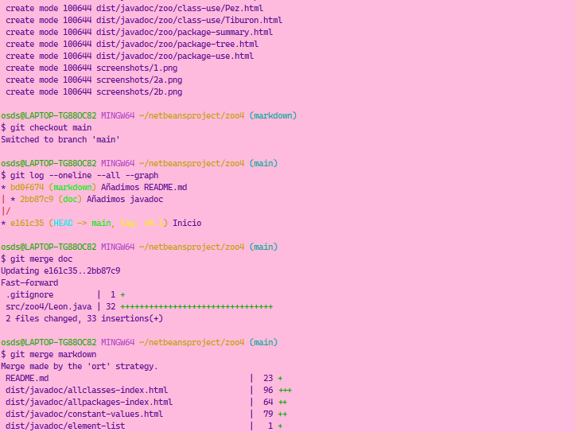
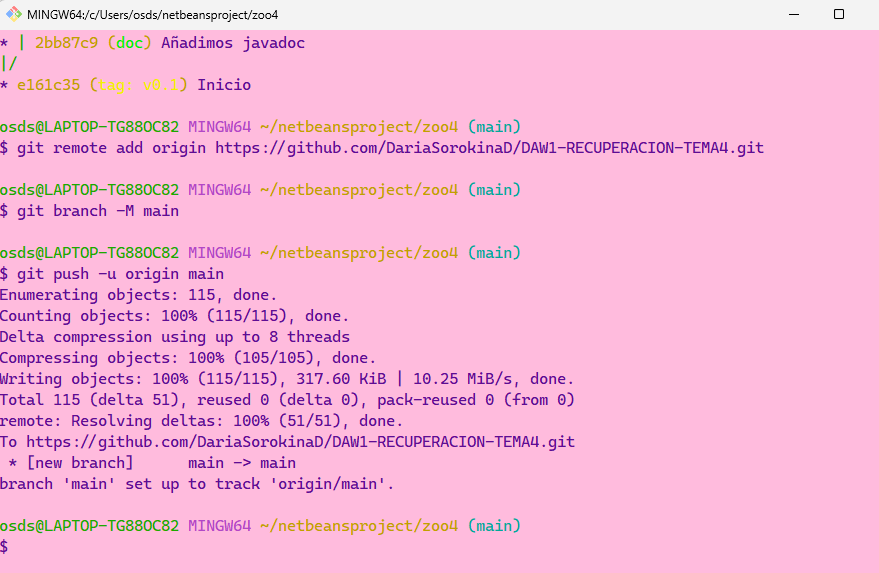
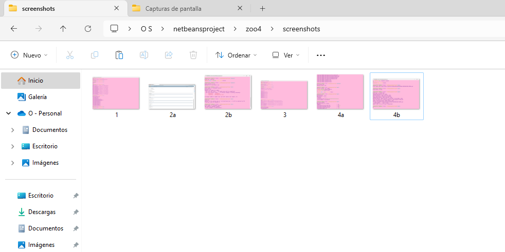
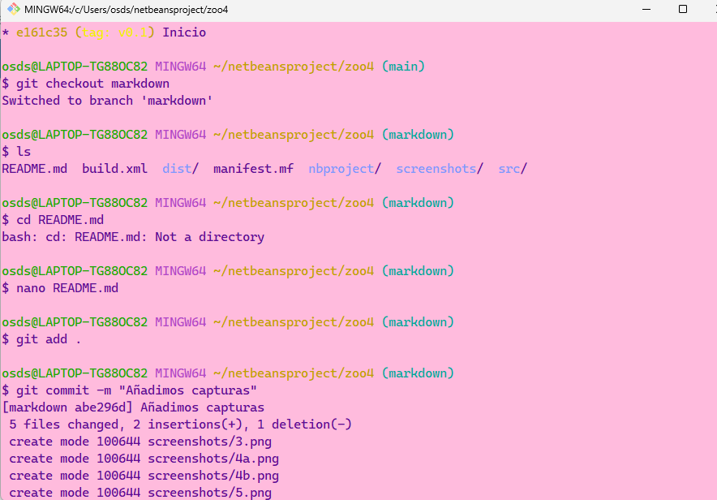
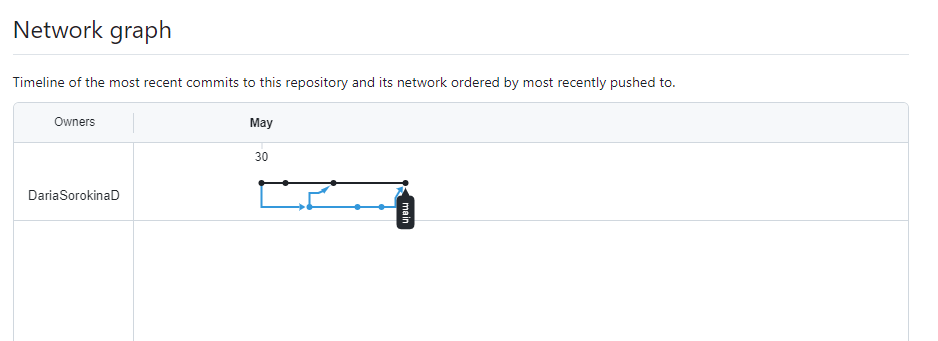

# RECUPERACIÓN DE TEMA 4 - ENTORNOS DE DESARROLLO #

***DOCUMENTACIÓN, OPTIMIZACIÓN Y CONTROL DE VERSIONES***

## Daria Sorokina ##

## EJERCICIO 1 ##

## EJERCICIO 2 ##

## EJERCICIO 3 ##

## EJERCICIO 4 ##

## EJERCICIO 5 ##

## EJERCICIO 6 ##

